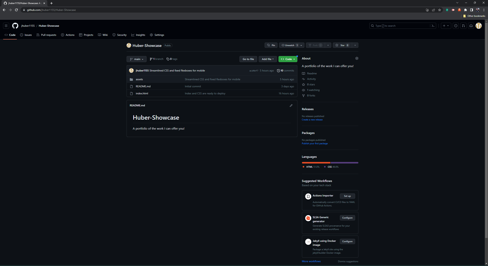

# Huber Showcase

## A portfolio of the work I can offer you!

This showcase is a portfolio of the projects I have completed in the past demonstrating both my competence and capability when it comes to various coding projects under a variety of systems, languages, and techniques. My hope is that it will allow you, as a potential employer, to determine if the skills I have to offer can meet any of the needs your current projects may have.

This portfolio allowed me to flex my creative coding muscles while allowing you a rubric to judge if I may be a good fit for your team and your projects. This portfolio is also a site I can keep updating with continuing educational materials. When I learn a new system, or a new language, I can add it to this portfolio as well as my mental toolbox. It is a cyber manifestation of what I have learned as well as what I am currently learning.

This portfolio currently uses HTML and CSS exclusively, but I hope to add more (like Javascript) in the future to bring more personality and style to the elements found within. I learned about styling, flexboxes, and image manipulation to get the background video in place and working. I also learned a bit about sourcing images with the alt tag and linking to items both within the current webpage itself (like the about me and contact me button) as well as to other pages (like my deployed github page on the first application).

## Installation

To deploy this site, log onto [Github Pages](www.github.com)

Then click the green 'Code' button and clone the repository using HTTPS or an established SSH key into your preferred folder destination.

Run the Git Bash terminal (or its equivalent) and using the git commands, enter the repository Huber-Showcase.

Run the git command `code .`

Open the index.html with the Live Server Extension in VS Code (or another code editor of preference)

A link for the deployed website can be found at:
[Huber Programming](https://jhuber1155.github.io/Huber-Showcase)

## Credits

This portfolio was made with the help of my instructors and my fellow students in the UCLA Coding Bootcamp. Other helpful resources came from [W3Schools Online Web Tutorials](https://www.w3schools.com/) and [MDN Web Docs](https://developer.mozilla.org/en-US/).

I had particular help with the background video and image resizing thanks to the following:

Chris Coyier at [CSS-Tricks](www.css-tricks.com/full-page-background-video-styles/)

Dudley Story at [The New Code](http://thenewcode.com/777/Create-Fullscreen-HTML5-Page-Background-Video)

User: CutoverRooster at [Stack Overflow](https://stackoverflow.com/questions/16687382/background-video-that-resizes-to-always-fit-the-browser)

I also used photos from several websites which include:

[Interlocking Rings by Nick Design on Unsplash.com](https://unsplash.com/photos/a-close-up-of-a-bunch-of-rings-on-a-black-background-U1YLgjA0tLg?utm_source=unsplash&utm_medium=referral&utm_content=creditShareLink)

[3d Cube by User: 8machine_ on Unsplash.com](https://unsplash.com/photos/oWFZm4NAvMQ?utm_source=unsplash&utm_medium=referral&utm_content=creditShareLink)

[Prisms by Rohit Choudhari on Unsplash.com](https://unsplash.com/photos/KjuR1MFpoqA?utm_source=unsplash&utm_medium=referral&utm_content=creditShareLink)

[White Building Side by Richard Gomez Angel on Unsplash.com](https://unsplash.com/photos/5YM26lUicfU?utm_source=unsplash&utm_medium=referral&utm_content=creditShareLink)

[Computer with code by Rezvani on Unsplash.com](https://unsplash.com/photos/a-group-of-people-sitting-around-a-laptop-computer-MnPWB-ybjHQ?utm_source=unsplash&utm_medium=referral&utm_content=creditShareLink)

[Vaporwave Gif by robokoboto](https://alphacoders.com/users/profile/69089)

## License 

Copyright (c) [2023] [John Huber]

Permission is hereby granted, free of charge, to any person obtaining a copy
of this software and associated documentation files (the "Software"), to deal
in the Software without restriction, including without limitation the rights
to use, copy, modify, merge, publish, distribute, sublicense, and/or sell
copies of the Software, and to permit persons to whom the Software is
furnished to do so, subject to the following conditions:

The above copyright notice and this permission notice shall be included in all
copies or substantial portions of the Software.

THE SOFTWARE IS PROVIDED "AS IS", WITHOUT WARRANTY OF ANY KIND, EXPRESS OR
IMPLIED, INCLUDING BUT NOT LIMITED TO THE WARRANTIES OF MERCHANTABILITY,
FITNESS FOR A PARTICULAR PURPOSE AND NONINFRINGEMENT. IN NO EVENT SHALL THE
AUTHORS OR COPYRIGHT HOLDERS BE LIABLE FOR ANY CLAIM, DAMAGES OR OTHER
LIABILITY, WHETHER IN AN ACTION OF CONTRACT, TORT OR OTHERWISE, ARISING FROM,
OUT OF OR IN CONNECTION WITH THE SOFTWARE OR THE USE OR OTHER DEALINGS IN THE
SOFTWARE.